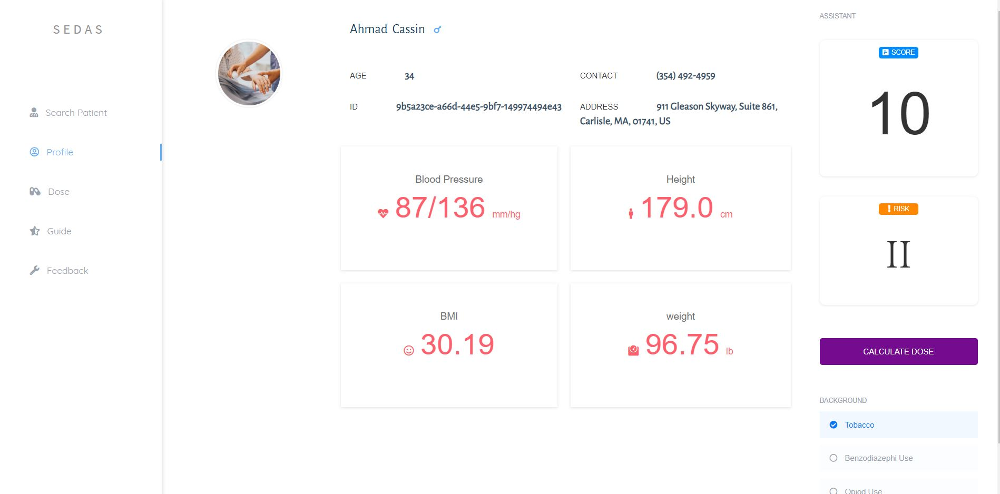
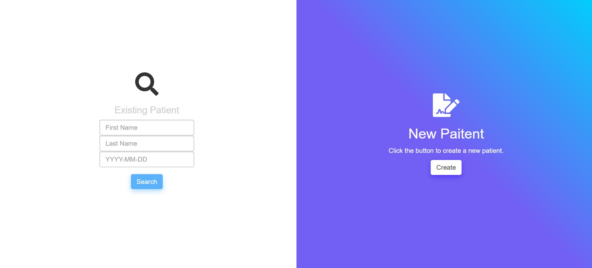
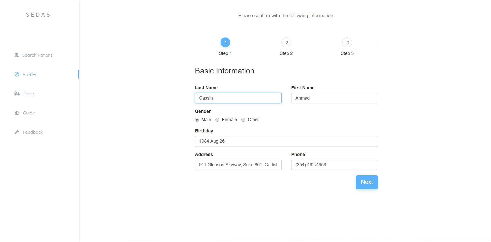
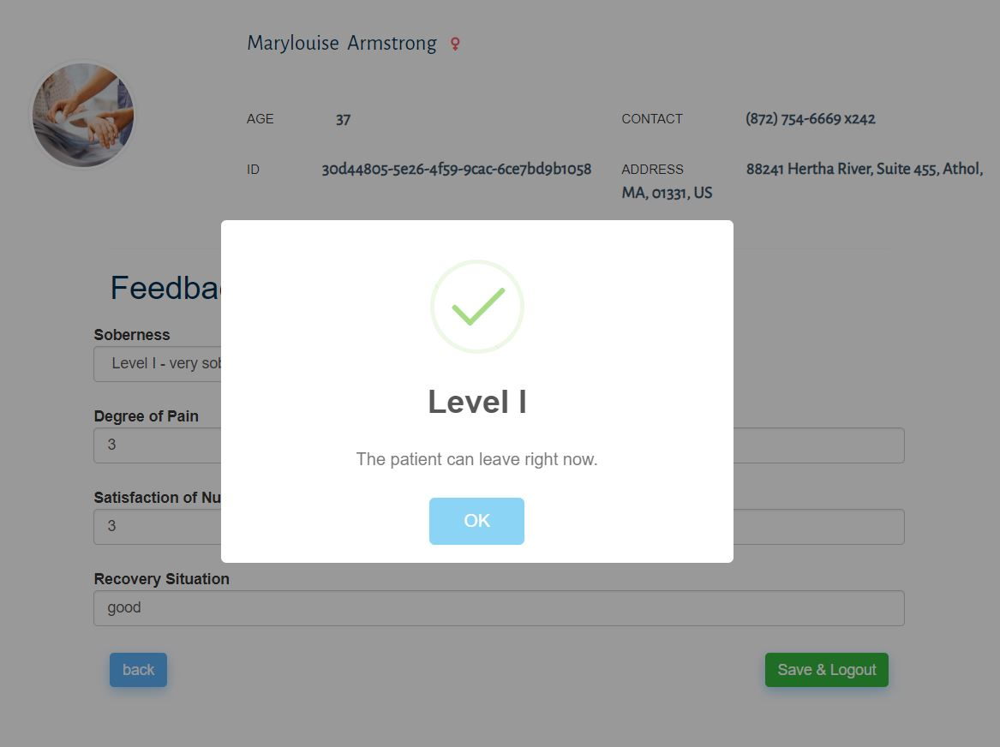
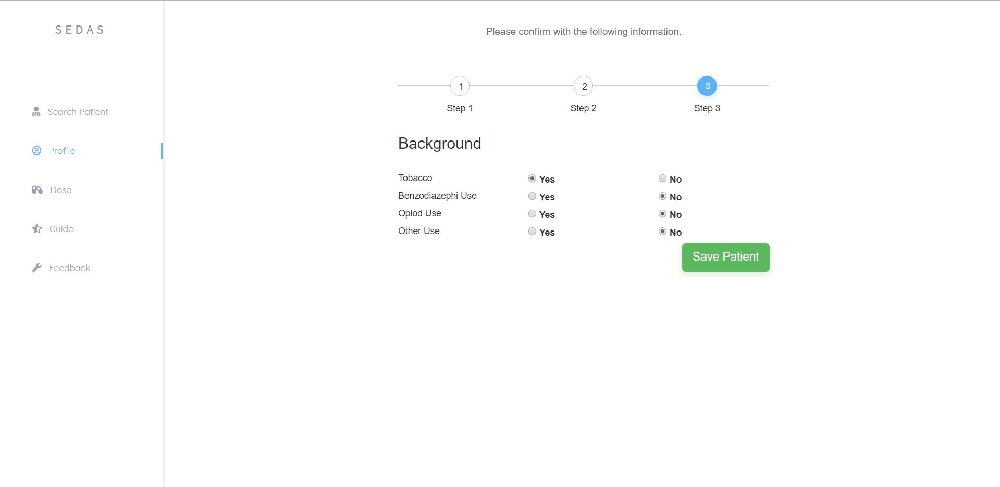

# Sedation Assist (Clinical Decision Support Web-based Application)

- Developed a web application which provides risk analysis for sedation supported by spring boot
- Used <strong>mongoDB</strong> to store various patient data, the website can provide the dose and type of sedation for the
nurses. Used FHIR database for the medical record data.
- Web pages are developed by using <strong>Java(OOD)</strong>, <strong>javascript</strong> and <strong>HTML</strong>

 

 

 

 

 

